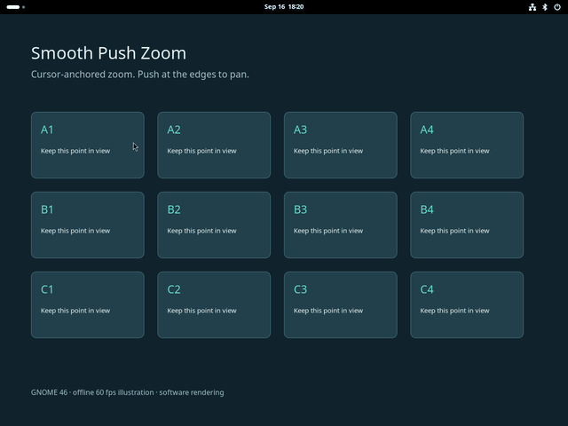
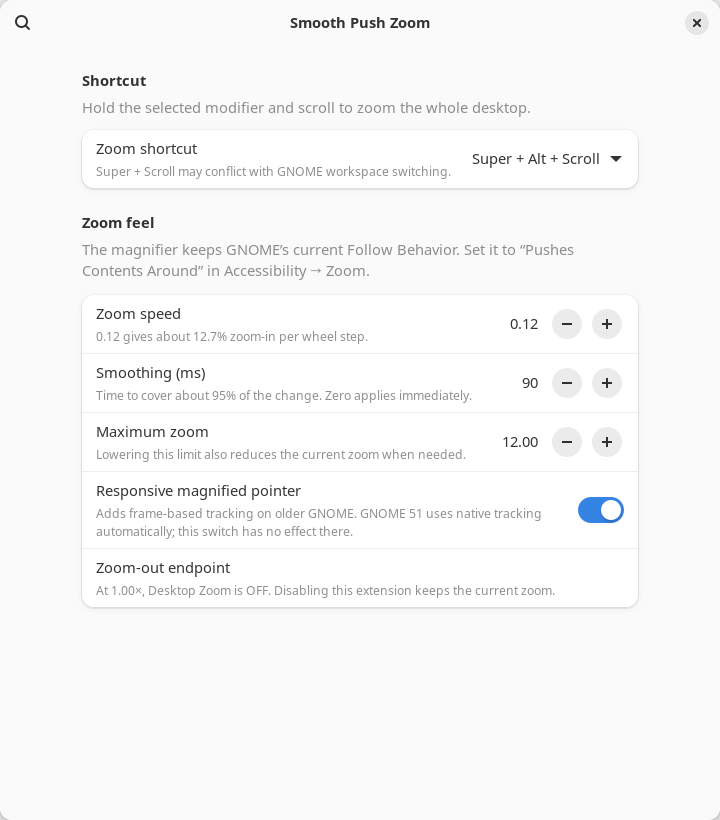
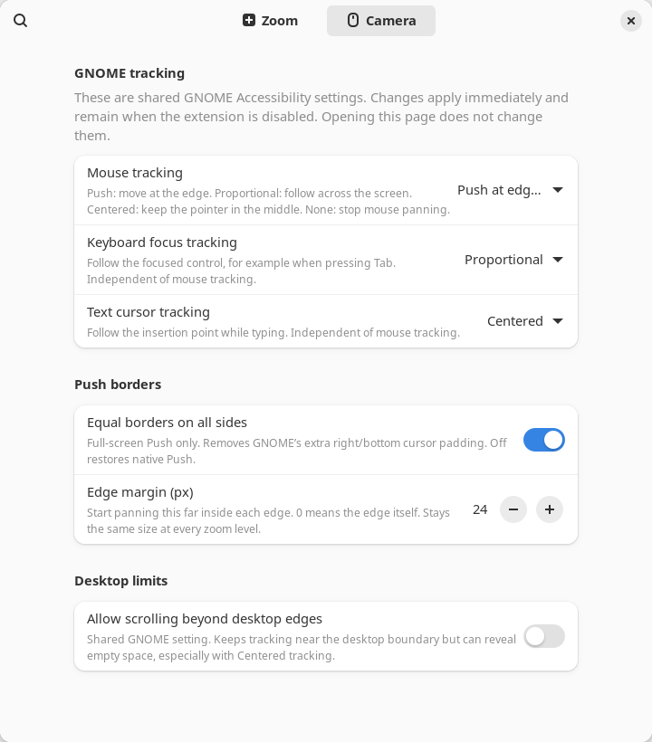

# Smooth Push Zoom

**macOS-style smooth zoom for GNOME** — hold **Super + Alt** and scroll.

Zoom glides continuously instead of jumping in steps, the content under the
cursor stays put, and GNOME's edge-push panning keeps working, now with equal
margins on all four edges.



[Watch the 60 fps MP4](docs/demo.mp4) · GIF preview is 20 fps.
An offline illustration rendered by an isolated GNOME 46 compositor with fixed
1/60-second animation steps and continuous 2.5-second zoom gestures.
It is not a real-time recording or hardware latency
benchmark.

## Features

- Cursor-anchored full-screen zoom: the content under the cursor stays in place.
- Smooth, proportional zoom steps for mouse wheels and touchpads.
- Preserves GNOME's selected tracking mode, including **Pushes Contents Around**.
- Equal, adjustable Push margins on all four edges, independent of zoom level.
- Camera preferences for native mouse, keyboard focus and text cursor tracking.
- Zooming out to **1.00× turns Desktop Zoom off**.
- External GNOME zoom changes take precedence over an ongoing animation.
- Adjustable shortcut, speed, smoothing, maximum zoom and pointer refresh.

The current release is [0.1.0](https://github.com/jinkim0823/smooth-push-zoom/releases/tag/v0.1.0).
The standard package targets **GNOME Shell 46**. Tests use a separate GNOME 46
Wayland session; this is not a claim that every hardware or display
configuration has been validated.

## Install

Download the `.shell-extension.zip` asset from a release, then run:

```sh
gnome-extensions install --force smooth-push-zoom@jinkim0823.github.io.shell-extension.zip
```

Log out and back in, then enable the extension:

```sh
gnome-extensions enable smooth-push-zoom@jinkim0823.github.io
```

The GitHub-generated **Source code (zip)** is a source archive, not the packaged
extension. To install from source, run `./install.sh` in the extracted project.
No root access is needed.

If replacing the earlier local build, first disable it:

```sh
gnome-extensions disable smooth-push-zoom@local
```

Both builds use the same settings schema, so preferences are retained. Enable
only one build at a time. The installer does not delete the earlier local build.

## Use and configure



On the extension’s **Camera** page, select **Push at edges** for edge-only panning.
GNOME Accessibility calls this **Pushes Contents Around**.
Hold **Super + Alt** and scroll vertically to zoom.

Open extension preferences from the Extensions application or run:

```sh
gnome-extensions prefs smooth-push-zoom@jinkim0823.github.io
```

| Setting | Default | Meaning |
| --- | --- | --- |
| Shortcut | Super + Alt | Modifier keys held while scrolling |
| Zoom speed | 0.12 | About +12.7% per upward wheel step |
| Smoothing | 90 ms | Time to cover about 95% of a zoom change; 0 is immediate |
| Maximum zoom | 12× | Upper limit for zoom controlled by this extension |
| Responsive pointer | On | Additional frame-based tracking on older GNOME |
| Equal Push borders | On | Full-screen mouse Push uses equal hotspot insets instead of native cursor padding |
| Edge margin | 24 px | Visible logical-pixel inset on every edge; 0–200, independent of zoom |

### Camera behavior



Mouse, keyboard focus, and text cursor tracking each offer GNOME’s **Push**,
**Proportional**, **Centered**, and **No tracking** choices. These controls edit
the shared GNOME Accessibility settings directly. Opening preferences changes
nothing; choices you make persist after disabling the extension. No tracking
disables that source of panning, not the other two sources or cursor-anchored zoom.

Example combinations to try (not automatic presets):

| Use | Mouse | Keyboard focus | Text cursor |
| --- | --- | --- | --- |
| Edge browsing | Push | No tracking | No tracking |
| Typing with keyboard navigation | Push | Proportional | Centered |
| Keep the pointer central | Centered | No tracking | No tracking |
| Continuous following | Proportional | No tracking | No tracking |

**Equal borders** replaces only full-screen mouse Push. The default 24 px margin
is measured inward from the visible viewport edge and refers to the pointer
hotspot; a large cursor sprite may extend past it. Zero means pan at the edge.
For small viewports the inset is capped at 45% of each dimension. Switching it
off restores native Push. Focus/caret Push and moving lenses stay native.

**Allow scrolling beyond desktop edges** controls GNOME’s desktop clamp, a
separate limit from the Push trigger margin. Off avoids empty space. On lets the
camera travel further, especially in Centered mode, but may expose blank areas.
Physical pointer travel still ends at the desktop boundary.

Disabling the extension keeps the current zoom. Use GNOME Accessibility settings
to turn zoom off independently. Lowering the maximum clamps the current zoom;
independent changes made later in GNOME settings are not restricted by that limit.

## Compatibility and limitations

| Environment | Status |
| --- | --- |
| GNOME 46 / Wayland | Standard package; automated compositor integration tested |
| GNOME 46 / X11 | Not yet tested |
| GNOME 47–50 | Magnifier source reviewed; not enabled in release metadata |
| GNOME 51 / Wayland | Separate experimental package; source and mock checks only |
| KDE, XFCE, other desktops | Not supported; this is a GNOME Shell extension |

Desktop bounds may override the zoom anchor to prevent empty space, especially
when zooming out. Moving lenses and partial-screen regions retain GNOME's native
zoom policy. Multi-monitor, mixed scaling, lock/unlock, hardware input feel and
focus/caret interactions need more testing. Avoid enabling another scroll-zoom
extension simultaneously. See [testing details](TESTING.md).

GNOME 51 uses native event-driven pointer tracking automatically; the optional
responsive-pointer switch has no effect there. Build its preview with
`./pack.sh --experimental-51`. Do not install that preview as a stable release.

## Development

Required tools: GJS, GNOME Shell extension tools, GLib schema compiler, Bash,
Node.js (syntax checks), and unzip. The extension itself has no Node.js runtime
or network dependency.

```sh
./scripts/check.sh
./pack.sh
bash tests/integration.sh  # isolated GNOME 46 session; requires compositor access
```

Generated ZIPs are written to `dist/`. Source, tests and documentation belong in
Git; built ZIPs are attached to releases. See [architecture](docs/architecture.md)
and [contribution guide](CONTRIBUTING.md).

## License and credits

GNU GPL version 3; see [LICENSE](LICENSE) and [NOTICE.md](NOTICE.md).
Based on [Deperto](https://github.com/dennisguim/deperto) by Dennis Guimarães,
with independently developed behavior and maintenance changes.
